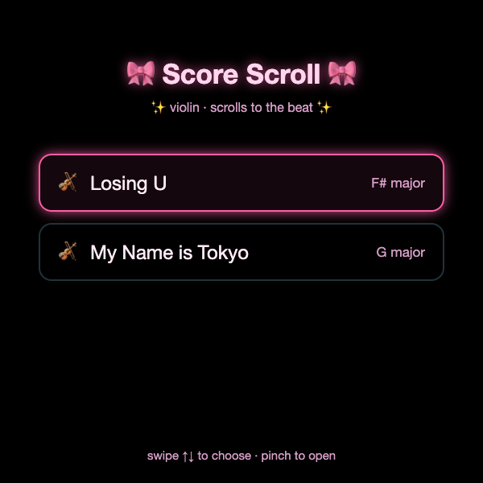
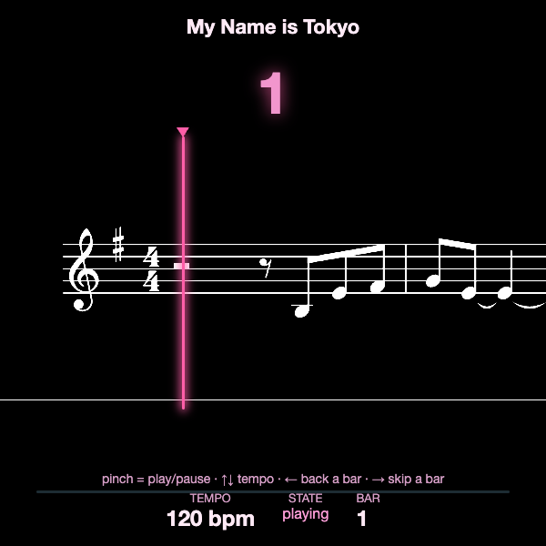

# 🎀 Score Scroll

Auto-scrolling sheet music for the **Meta Ray-Ban Display** glasses. A violin part
scrolls right-to-left and every note crosses a fixed playhead line *exactly on the
beat* — like Guitar Hero, but for real notation. Built as a plain web app that runs
on the glasses, driven entirely by Neural Band pinches and swipes.




> **🚀 Live MVP — upload your own score:** https://score-scroll-app.vercel.app
> Drop in a MusicXML file and it renders **in your browser** and scrolls on the
> beat — no install, no account. Code in [`app/`](./app); productionization plan in
> [`planning/`](./planning). The original two-song demo lives in [`web/`](./web).

## How it works

The glasses run a standard HTML/CSS/JS page (Meta's "Web Apps" path), so there's no
native build — just a static site served over HTTPS. Two constraints shape
everything:

- **The display is additive** — black is fully transparent, white is brightest. So
  the UI glows light-on-dark, and sheet music is inverted to white-on-black.
- **Input is arrow keys + Enter only** — the Neural Band turns pinches/swipes into
  keyboard events. No cursor, no touch.

### The hard part: beat-accurate scrolling

In engraved music, horizontal spacing is **not** proportional to time (a half note
isn't twice as wide as a quarter note). Scrolling the image at constant speed
therefore drifts off the beat. The fix is an **offline render step** that produces,
for each song:

1. A long horizontal **notation strip** (PNG), inverted to white-on-black.
2. A **schedule** (`{ bpm, beatsPerBar, heightPx, points: [{ beat, x }] }`) mapping
   every note's beat onset to its pixel position.

At runtime the player runs a clock at the chosen BPM and slides the strip (GPU
`translate3d`) so the note due *now* sits under the playhead, interpolating between
the scheduled points. Changing tempo just rescales the clock — no re-render. All the
heavy lifting happens offline, so the glasses only move an image.

## Project layout

```
web/                 the glasses app (static site)
  index.html         self-contained player + menu
  assets/            <song>.png + <song>.json (generated)
  vercel.json        static deploy config
tools/               offline render pipeline (Node)
  render.js          MusicXML -> strip PNG + beat schedule
  render-overlay.js  (optional) render the HUD as a transparent overlay video
scores/              source MuseScore files
```

## Add a song

You need [Node](https://nodejs.org), Google Chrome, and
[MuseScore 4](https://musescore.org) (for the `.mscz` → MusicXML export).

```bash
# 1. export MuseScore to MusicXML
"/Applications/MuseScore 4.app/Contents/MacOS/mscore" -o build/mysong.musicxml scores/mysong.mscz

# 2. render the strip + beat schedule into web/assets/
cd tools && npm install
node render.js ../build/mysong.musicxml mysong 120     # <musicxml> <id> <bpm>
```

Then add it to the menu in `web/index.html`:

```js
var SONGS = [
  { id:"mysong", title:"My Song", key:"G major" },  // id must match the asset basename
];
```

Assumes a single-line treble part in 4/4 with no repeats.

## Run locally

```bash
cd web && python3 -m http.server 8000
# open http://localhost:8000  (?song=0 deep-links straight into a song)
```

A 600×600 Chrome window with arrow keys + Enter behaves just like the glasses. Tip:
DevTools → device toolbar → 600×600.

## Deploy to the glasses

Serve `web/` over HTTPS from any static host ([Vercel](https://vercel.com): `cd web
&& vercel --prod`). Then add the URL to the glasses: **Meta AI app → Devices →
Display Glasses → App connections → Web apps → Add** (or scan a QR pointing at
`fb-viewapp://web_app_deep_link?appName=Score%20Scroll&appUrl=<your-https-url>`).

## Controls

| Gesture | Key | Action |
|---|---|---|
| Pinch | Enter | Play / pause (resumes with a count-in from the bar start) |
| Swipe ↑ / ↓ | Arrow ↑ / ↓ | Tempo ± |
| Swipe ← | Arrow ← | Back a bar (at the start: return to menu) |
| Swipe → | Arrow → | Skip a bar |

## Faking a clean demo (optional)

The glasses don't sync the HUD with screen recording, so demo videos are composited.
`tools/render-overlay.js` renders the scrolling score as a transparent overlay you
drop onto real POV footage:

```bash
cd web && python3 -m http.server 8930 &
cd ../tools
node render-overlay.js 1 alpha 30 ../build/frames 8930   # <songIdx> <alpha|black> <fps> <out> <port>
# then encode the frames to ProRes 4444 / VP9 webm (alpha) or H.264 (black + Screen blend)
```

## License

Code is MIT (see `LICENSE`). The bundled song arrangements remain the property of
their respective rights holders and are included for demonstration only.
